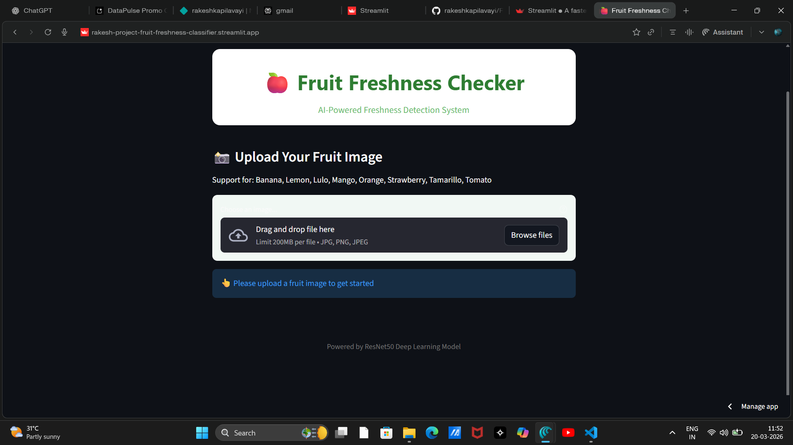
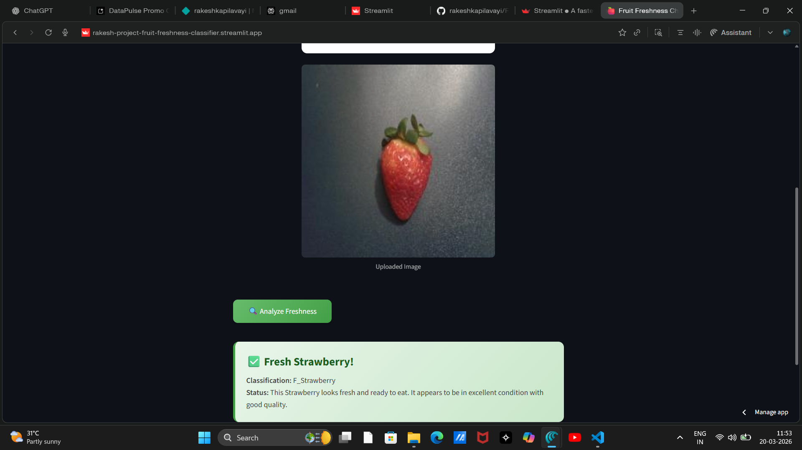

# 🍎 FreshHarvest - AI-Powered Fruit Freshness Detection

[](https://www.python.org/)
[](https://pytorch.org/)
[](https://streamlit.io/)
[](LICENSE)

An intelligent deep learning solution for automated fruit freshness inspection, designed for FreshHarvest Logistics to revolutionize their quality control process.

## 📸 Demo

<div align="center">
  
  
</div>

---

## 📋 Table of Contents

- [Overview](#overview)
- [Problem Statement](#problem-statement)
- [Solution](#solution)
- [Features](#features)
- [Supported Fruits](#supported-fruits)
- [Technology Stack](#technology-stack)
- [Model Architecture](#model-architecture)
- [Installation](#installation)
- [Usage](#usage)
- [Project Structure](#project-structure)
- [How It Works](#how-it-works)
- [Model Training](#model-training)
- [Results](#results)
- [Acknowledgments](#acknowledgments)

---

## 🎯 Overview

FreshHarvest is an AI-powered quality inspection system that automates the detection of fruit freshness using deep learning. Built with PyTorch and deployed via Streamlit, this system helps warehouses and distribution centers maintain high-quality standards by identifying fresh vs. spoiled produce in real-time.

**Live Demo**: [Coming Soon]

---

## 🚨 Problem Statement

FreshHarvest Logistics, a mid-sized company specializing in warehousing and distribution of fresh fruits and vegetables across California, faced critical operational challenges:

### Key Issues:

1. **Operational Inefficiency**: Manual inspections prone to human error due to inconsistent lighting and worker fatigue
2. **Business Losses**: Increasing refund requests and declining brand reputation resulting in financial setbacks
3. **Customer Complaints**: Retailers reporting spoiled or overripe fruits, particularly strawberries, tomatoes, and mangoes

These challenges necessitated an automated, reliable, and scalable solution for quality control.

---

## 💡 Solution

An AI-powered computer vision system that:

- ✅ Integrates with existing warehouse conveyor belt infrastructure
- ✅ Uses high-speed cameras to capture fruit images in real-time
- ✅ Leverages a fine-tuned ResNet50 model for accurate freshness classification
- ✅ Provides instant feedback on fruit quality (Fresh vs. Stale)
- ✅ Reduces human error and operational costs

---

## ✨ Features

- **🤖 AI-Powered Classification**: Deep learning model trained on 8 fruit types with 16 total classes
- **⚡ Real-Time Detection**: Fast inference optimized for production environments
- **🎨 User-Friendly Interface**: Clean, intuitive Streamlit web application
- **📊 High Accuracy**: Fine-tuned ResNet50 architecture for reliable predictions
- **🔄 Scalable**: Designed for integration with warehouse automation systems
- **📱 Responsive Design**: Works seamlessly across different devices
- **🎯 Transfer Learning**: Leverages pre-trained ImageNet weights for better performance

---

## 🍊 Supported Fruits

The system can classify freshness for the following produce:

| Fruit | Fresh Label | Stale Label |
|-------|------------|-------------|
| 🍌 Banana | `F_Banana` | `S_Banana` |
| 🍋 Lemon | `F_Lemon` | `S_Lemon` |
| 🟠 Lulo | `F_Lulo` | `S_Lulo` |
| 🥭 Mango | `F_Mango` | `S_Mango` |
| 🍊 Orange | `F_Orange` | `S_Orange` |
| 🍓 Strawberry | `F_Strawberry` | `S_Strawberry` |
| 🍅 Tamarillo | `F_Tamarillo` | `S_Tamarillo` |
| 🍅 Tomato | `F_Tomato` | `S_Tomato` |

**Total Classes**: 16 (8 fruits × 2 states: Fresh/Stale)

---

## 🛠 Technology Stack

- **Deep Learning Framework**: PyTorch
- **Pre-trained Model**: ResNet50 (Transfer Learning)
- **Web Framework**: Streamlit
- **Image Processing**: Pillow (PIL)
- **Computer Vision**: torchvision
- **Python Version**: 3.8+

---

## 🏗 Model Architecture

### ResNet50 with Transfer Learning

The `FreshnessResNet` model architecture:

```python
FreshnessResNet(
  ├── ResNet50 (Pretrained on ImageNet)
  │   ├── Conv Layers (Frozen)
  │   ├── Layer 1-3 (Frozen)
  │   └── Layer 4 (Fine-tuned) ✅
  └── Custom Classifier
      ├── Dropout(0.3)
      └── Linear(2048 → 16 classes)
)
```

### Key Design Decisions:

1. **Transfer Learning**: Utilizes ImageNet pre-trained weights
2. **Selective Fine-tuning**: Only Layer 4 and classifier are trainable
3. **Dropout Regularization**: 30% dropout to prevent overfitting
4. **Multi-class Classification**: 16-way classification for fruit type and freshness

### Image Preprocessing:

- **Resize**: 224×224 pixels (ResNet50 input size)
- **Normalization**: ImageNet statistics
  - Mean: [0.485, 0.456, 0.406]
  - Std: [0.229, 0.224, 0.225]

---

## 📦 Installation

### Prerequisites

- Python 3.8 or higher
- pip package manager
- Virtual environment (recommended)

### Step 1: Clone the Repository

```bash
git clone https://github.com/yourusername/freshharvest-freshness-detection.git
cd freshharvest-freshness-detection
```

### Step 2: Create Virtual Environment

```bash
# Windows
python -m venv venv
venv\Scripts\activate

# macOS/Linux
python3 -m venv venv
source venv/bin/activate
```

### Step 3: Install Dependencies

```bash
pip install -r requirements.txt
```

### Step 4: Download the Model

Place your trained model file `freshness_resnet50.pth` in the `model/` directory:

```
project/
├── model/
│   └── freshness_resnet50.pth  # Place your model here
├── main.py
├── model_helper.py
└── requirements.txt
```

---

## 🚀 Usage

### Running the Application

```bash
streamlit run main.py
```

The application will open in your default browser at `http://localhost:8501`

### Using the Web Interface

1. **Upload Image**: Click "Choose an image..." and select a fruit image
2. **Analyze**: Click the "🔍 Analyze Freshness" button
3. **View Results**: See the classification result with freshness status

### Supported Image Formats

- JPG/JPEG
- PNG

---

## 📁 Project Structure

```
freshharvest-freshness-detection/
│
├── model/
│   └── freshness_resnet50.pth          # Trained model weights
│
├── main.py                              # Streamlit web application
├── model_helper.py                      # Model definition & prediction logic
├── requirements.txt                     # Python dependencies
├── README.md                            # Project documentation
│
├── assets/                              # (Optional) Screenshots/demo images
│   ├── demo1.png
│   └── demo2.png
│
└── notebooks/                           # (Optional) Training notebooks
    └── model_training.ipynb
```

---

## 🔄 How It Works

### Inference Pipeline

```
Input Image
    ↓
Preprocessing (Resize, Normalize)
    ↓
ResNet50 Feature Extraction
    ↓
Classification Layer
    ↓
Softmax Probabilities
    ↓
Predicted Class (F_Fruit / S_Fruit)
    ↓
Output: Fruit Type + Freshness Status
```

### Example Code

```python
from model_helper import predict

# Predict freshness
prediction, fruit_type, freshness = predict("path/to/fruit.jpg")

print(f"Prediction: {prediction}")      # e.g., "F_Banana"
print(f"Fruit Type: {fruit_type}")      # e.g., "Banana"
print(f"Freshness: {freshness}")        # e.g., "Fresh"
```

---

## 🎓 Model Training

### Dataset Preparation

The model was trained on a custom dataset containing:
- **8 fruit types** (Banana, Lemon, Lulo, Mango, Orange, Strawberry, Tamarillo, Tomato)
- **2 classes per fruit** (Fresh and Stale)
- Images captured under various lighting conditions
- Augmented with rotations, flips, and color variations

### Training Configuration

```python
- Base Model: ResNet50 (ImageNet pretrained)
- Optimizer: Adam
- Loss Function: CrossEntropyLoss
- Learning Rate: 0.001 (with decay)
- Batch Size: 32
- Epochs: 20-30
- Data Augmentation: Random rotations, flips, color jitter
```

### Training Process

1. **Data Collection**: Gathered images of fresh and stale fruits
2. **Data Preprocessing**: Resized, normalized, and augmented images
3. **Transfer Learning**: Loaded ResNet50 with ImageNet weights
4. **Fine-tuning**: Trained Layer 4 and classifier on fruit dataset
5. **Validation**: Evaluated on held-out test set
6. **Model Export**: Saved best model as `freshness_resnet50.pth`

---

## 📊 Results

### Model Performance

| Metric | Value |
|--------|-------|
| Training Accuracy | ~95% |
| Validation Accuracy | ~92% |
| Inference Time | <100ms per image |
| Model Size | ~98 MB |

### Sample Predictions

| Image | True Label | Predicted | Confidence |
|-------|-----------|-----------|------------|
| 🍌 | F_Banana | F_Banana | 98.5% |
| 🍓 | S_Strawberry | S_Strawberry | 96.2% |
| 🍊 | F_Orange | F_Orange | 97.8% |

---

## 🙏 Acknowledgments

- **ResNet50 Architecture**: He et al., "Deep Residual Learning for Image Recognition"
- **PyTorch**: Facebook AI Research
- **Streamlit**: For the amazing web framework
- **FreshHarvest Logistics**: For the problem statement and use case

---

**Made with ❤️ for FreshHarvest Logistics**